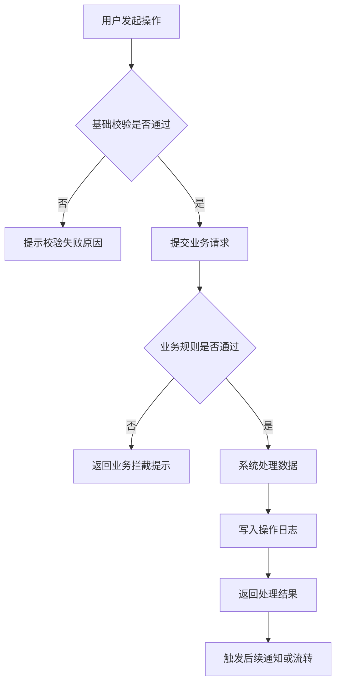
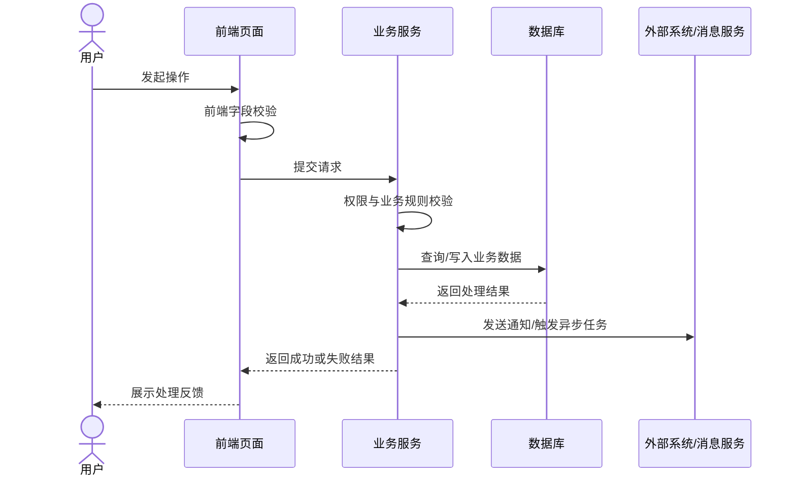
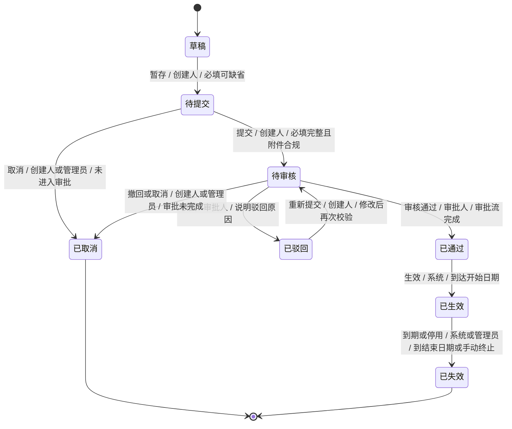

# Mermaid Diagram Rules

Use these rules when creating, reviewing, or revising PRD diagrams.

## Selection

- Use `flowchart TD` for system flows with cross-system processing, branching, validation, asynchronous jobs, and exception paths.
- Do not use `sequenceDiagram` in PRDs by default. Use it only for explicit user requests about backend interaction timing in the PRD; otherwise leave sequence diagrams to technical design documents.
- Use `stateDiagram-v2` when a business object's status affects visible data, available actions, permissions, approval handling, scheduled or business-event processing, risk calculation, reminders/notifications, or downstream business results.
- Use `stateDiagram-v2` for lightweight computed statuses when dates, records, rules, or upstream data derive statuses that affect page labels, risk buttons, counts, scheduled scans, notifications, or downstream recognition. These are business state machines even when no user action directly moves the status.
- Do not use a state machine solely for transient operation results such as loading, save success/failure, or one-time export completion unless they drive business decisions or subsequent operations.

## General Rules

- Use Chinese labels unless the product, codebase, or engineering convention uses English.
- Keep node names short and business-readable.
- Put state transition rules directly on `stateDiagram-v2` transition labels when they are short enough. Use the format `操作 / 角色 / 条件` or `触发事件 / 条件 -> 结果`.
- Put long validation rules, data fields, permission checks, and exception handling in page details, permission tables, or exception tables rather than overloading node labels.
- For computed statuses, put formulas, priority rules, date windows, and edge conditions in a focused status calculation table after the diagram.
- Render planned normal paths, rejection paths, cancellation paths, timeout paths, and system exception paths.
- For missing information already identified by the plan, render a minimal diagram with `待确认` nodes and list the missing decisions under "待确认事项".
- Do not create generic transition-supplement tables after a state machine that already explains the flow. Use lightweight status-action tables for operation visibility, and focused exception tables for rollback, timeout, notification, or audit rules that materially affect implementation.

## Flowchart Pattern

## Sequence Pattern

Use only on explicit request.

## State Machine Pattern

After the diagram, add a table only for new implementation decisions. Prefer focused exception or status-action visibility tables over broad transition-supplement tables.
