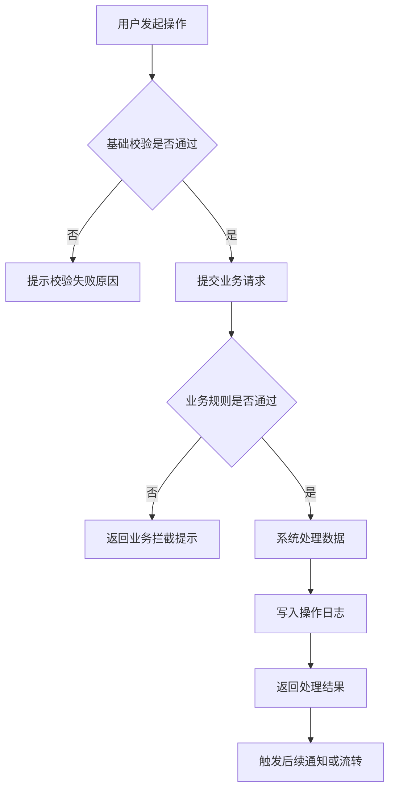
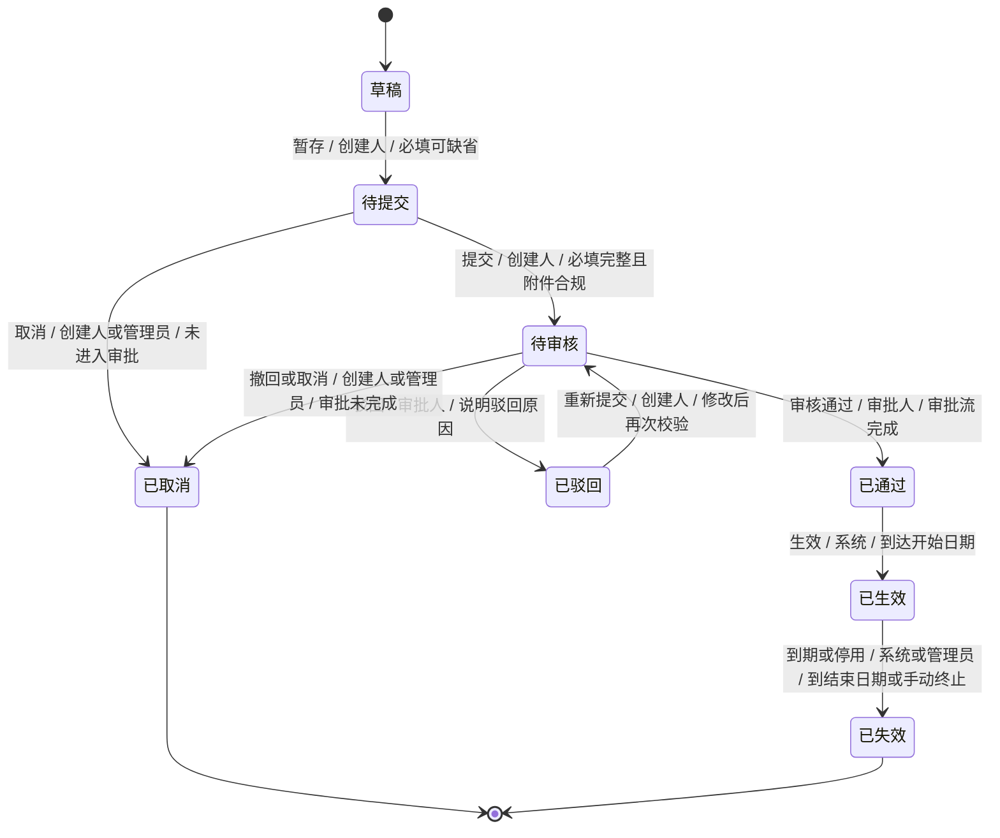

# PRD 模板

## 文档信息

| 字段 | 内容 |
| --- | --- |
| 需求名称 | 待补充 |
| 需求编号 | 待补充 |
| 版本 | V1.0 |
| 产品负责人 | 待补充 |
| 业务负责人 | 待补充 |
| 技术负责人 | 待补充 |
| 创建日期 | 待补充 |
| 当前状态 | 草稿 / 评审中 / 已确认 / 开发中 / 已上线 |
| 相关文档 | 待补充 |

## 一、需求整体描述

### 1.1 背景

- 业务背景：
- 当前问题：
- 触发原因：
- 相关数据或案例：

### 1.2 目标

| 目标类型 | 目标描述 | 衡量指标 |
| --- | --- | --- |
| 业务目标 | 待补充 | 待补充 |
| 用户目标 | 待补充 | 待补充 |
| 系统目标 | 待补充 | 待补充 |

### 1.3 项目范围

#### 1.3.1 涉及系统

| 系统 | 参与范围 | 上下游关系 | 负责人 |
| --- | --- | --- | --- |
| 待补充 | 待补充 | 待补充 | 待补充 |

## 二、需求分析

### 2.1 用户分析

| 用户角色 | 使用场景 | 核心诉求 | 痛点 | 使用频率 |
| --- | --- | --- | --- | --- |
| 待补充 | 待补充 | 待补充 | 待补充 | 待补充 |

### 2.2 业务文档附件

| 文档名称 | 类型 | 说明 | 链接或位置 |
| --- | --- | --- | --- |
| 待补充 | 业务规则  / 其他 | 待补充 | 待补充 |

### 2.3 业务主流程

> 按 generation plan 渲染业务主流程；具体页面规则、字段规则、按钮逻辑和校验规则放在第四章对应页面/操作中。

1. 待补充
2. 待补充
3. 待补充

## 三、系统功能描述

### 3.1 系统流程

#### 3.1.1 系统流程图

### 3.2 状态机

> 当业务对象的状态变化影响页面展示、可执行操作、权限、审批处理、自动/业务事件触发处理或下游业务结果时，本章节必须提供状态机；仅为保存成功、加载失败等一次性反馈时可省略。

#### 3.2.1 状态机图

#### 3.2.2 状态 - 操作映射

> 仅用于说明不同状态下列表行操作展示或隐藏哪些操作；操作入口、角色和状态流转不在本表重复，分别由页面结构、权限章节和状态机承载。

| 当前状态 | 展示操作 | 隐藏/禁用操作 |
| --- | --- | --- |
| 待补充 | 查看 / 编辑 / 取消 | 删除 / 审核 |

### 3.3 数据 / 系统依赖（按计划）

> 按 generation plan 渲染上游/下游系统、数据同步、导入导出字段口径、定时任务、外部接口、幂等重试、对账或日志监控；未被计划选中的纯页面操作无需单独维护本节。

| 依赖对象 | 类型 | 触发方式 / 频率 | 关键字段或口径 | 异常处理 | 说明 |
| --- | --- | --- | --- | --- | --- |
| 待补充 | 上游系统 / 下游系统 / 导入 / 导出 / 定时任务 / 外部接口 | 待补充 | 待补充 | 待补充 | 待补充 |

### 3.4 功能需求清单

| 功能编号 | 功能名称 | 优先级 | 所属菜单/页面 | 需求描述 | 验收标准 |
| --- | --- | --- | --- | --- | --- |
| FR-001 | 待补充 | P0/P1/P2 | 待补充 | 待补充 | 待补充 |

## 四、功能性需求细节讲解

> 本章是核心功能细节的主承载区。按菜单、页面和页面内场景拆解，每个页面集中说明状态 Tab、筛选、列表字段、列表行操作、页面内操作、操作表单、导出、校验和权限；空状态、无权限、成功/失败反馈等跟随具体页面规则或操作规则描述。
>
> 如果输入材料明确提到 PC、移动端、员工端、小程序端等多端场景，并且不同端存在独立用户、入口、页面目标、展示内容或操作差异，应在本章按端拆分页面或页面小节说明。多端页面说明不放入非功能性需求。

### 4.1 菜单：待补充

#### 4.1.1 页面：待补充

##### 页面目标

- 待补充

##### 页面入口

- 菜单路径：

##### 状态 Tab（按计划）

> 按 generation plan 和输入材料渲染 Tab。未被计划选中的页面省略本节；计划中标记为不确定的 Tab 放入“待确认事项”。

| Tab | 状态范围 | 默认排序 | 说明 |
| --- | --- | --- | --- |
| 全部 | 全部状态 | 最近更新时间倒序 | 默认展示全部或按业务默认 Tab 展示 |
| 待补充 | 待补充 | 待补充 | 待补充 |

##### 筛选项

> 按 generation plan 决定是否增加“适用状态/Tab”列。

| 字段 | 类型 | 是否必填 | 默认值 | 选项来源 | 规则说明 | 适用状态/Tab |
| --- | --- | --- | --- | --- | --- | --- |
| 待补充 | 输入框 / 下拉 / 日期 / 多选 / 级联 | 否 | 待补充 | 待补充 | 待补充 | 全部 |

##### 列表字段

> 按 generation plan 渲染列结构；常规列表只保留“字段、字段逻辑”，状态差异列表增加“适用状态/Tab”列。

| 字段 | 字段逻辑 | 适用状态/Tab |
| --- | --- | --- |
| 待补充 | 待补充 | 全部 |

##### 列表行操作

> 按 generation plan 渲染列表行操作。常规情况下只保留“操作名称、处理逻辑”；状态差异行操作增加“适用状态/Tab”列。操作入口、操作角色和流转后状态不在本表重复，分别由页面结构、权限章节和状态机承载。

| 操作名称 | 处理逻辑 | 适用状态/Tab |
| --- | --- | --- |
| 查看 | 打开详情页，展示当前记录完整信息 | 全部 |
| 编辑 | 打开编辑页或弹窗，按字段规则校验并保存 | 待提交 / 已驳回 |

##### 页面内操作

> 按具体操作拆小节说明，例如新增、编辑、导入、导出、审核、撤回、取消、预览、下载、上传、删除附件等。每个操作下直接描述该操作涉及的字段、校验、业务规则、成功/失败反馈和异常场景，不再单独维护操作汇总表。

###### 操作：新增（按计划）

页面形式：抽屉 / 弹窗 / 新页面 / 当前页内展开 / 待确认

字段及规则：

| 控件名称 | 控件类型 | 是否必填 | Tips说明 | 业务规则 |
| --- | --- | --- | --- | --- |
| 待补充 | 单行输入框 / 联想输入框 / 下拉框 / 日期 / 上传 / 单选 / 多选 / 文本域 / 小标题 | Y/N/条件必填 | 待补充 | 待补充 |
| 原型中的操作按钮 | 按钮 | / | / | 按原型和业务规则描述点击后的校验、保存、提交、关闭、预览审批、成功反馈或失败提示 |

###### 操作：导入（按计划）

- 导入入口：
- 模板下载：
- 导入范围：
- 字段校验：
- 失败数据处理：
- 导入结果反馈：

###### 操作：导出（按计划）

- 导出入口：
- 导出范围：
- 导出字段：
- 文件格式：
- 文件命名：
- 权限控制：
- 异步处理：

## 五、权限管理

> 系统整体权限由权限系统配置时，PRD 只说明本需求涉及的菜单权限、按钮/功能权限和列表数据权限，不重新定义角色职责，不描述具体业务动作流程。
>
> 详情页入口由按钮/功能权限控制；详情页内部字段展示、状态提示和业务说明放在第四章对应页面详情中，不在数据权限表中展开。

### 5.1 菜单权限

| 菜单层级 | 菜单 / 页面 / 入口 | 是否需要权限控制 | 无权限表现 | 说明 |
| --- | --- | --- | --- | --- |
| 一级菜单 | 待补充 | 是 / 否 / 待确认 | 隐藏菜单 / 无权限页 | 待补充 |
| 二级菜单 / 页面 | 待补充 | 是 / 否 / 待确认 | 隐藏入口 / 无权限页 | 待补充 |
| 多端入口（按计划） | 待补充 | 是 / 否 / 待确认 | 隐藏入口 / 无权限页 | 仅在输入材料明确存在独立端入口时渲染 |

### 5.2 按钮权限

| 页面 | 按钮 / 功能点 | 是否需要权限控制 | 无权限表现 | 说明 |
| --- | --- | --- | --- | --- |
| 待补充 | 新增 / 编辑 / 删除 / 导入 / 导出 / 审核 / 查看详情 / 查看附件 | 是 / 否 / 待确认 | 隐藏 / 不可点击 / 提示无权限 | 仅说明权限点和无权限表现，不定义授权角色职责 |

### 5.3 列表数据权限

> 仅说明列表页面的数据可见范围和过滤规则。详情页不在本表展开；详情入口由按钮权限控制，详情内部展示规则放在第四章对应页面详情中。

| 列表页面 | 数据可见范围 | 数据权限来源 | 过滤规则 | 无数据权限时表现 |
| --- | --- | --- | --- | --- |
| 待补充 | 待补充，例如仅展示当前登录账号拥有组织权限或数据权限范围内的数据 | 权限系统 / 组织权限 / 部门权限 / 地区权限 / 本人数据 / 其他 | 待补充 | 空列表 / 无权限提示 |

## 六、非功能性需求描述

> 本章节面向业务产品和评审人员，描述达成核心业务目标之外、但开发或上线前必须额外处理和解释的事项，例如历史数据处理、数据快照、审计、合规、上线初始化。不要在这里展开技术实现、系统降级、灾备、监控告警等技术方案，除非本需求明确要求。
>
> 移动端 / 员工端 / 小程序端等多端页面说明放第四章；企业微信、短信、邮件等通知能力放系统依赖、功能规则或验收标准；业务口径、数据来源、通知节点等未决问题放“待确认事项”。不要用非功能章节兜底承接功能点或待确认问题。

### 6.1 历史数据处理方案

#### 6.1.1 历史数据内容

说明本次上线前需要纳入系统的历史数据内容，例如线下历史合同数据、历史协议附件、历史审批结果、历史客户资料等。需要写清楚数据范围、时间范围、业务范围，以及是否影响上线后的查询、导出、审批或下游展示。

#### 6.1.2 处理方式

说明历史数据由谁处理、通过什么方式处理，例如开发补录、业务手工录入、批量导入、暂不处理等。需要写清楚业务确认方式、处理截止时间、异常数据如何处理，以及上线前是否需要抽检确认。

### 6.2 数据快照规则

#### 6.2.1 快照场景及字段

说明哪些业务场景需要保留业务发生时的信息，以及需要保留哪些字段。例如入职详情需要保留原始录入数据，涉及字段包括入职日期、部门、岗位等。

## 验收标准

| 编号 | 验收项 | 验收标准 | 验收方式 |
| --- | --- | --- | --- |
| AC-001 | 待补充 | 待补充 | 产品验收 / 测试用例 / 数据核对 |

## 待确认事项

| 编号 | 问题 | 影响范围 | 负责人 | 截止时间 |
| --- | --- | --- | --- | --- |
| Q-001 | 待补充 | 待补充 | 待补充 | 待补充 |
